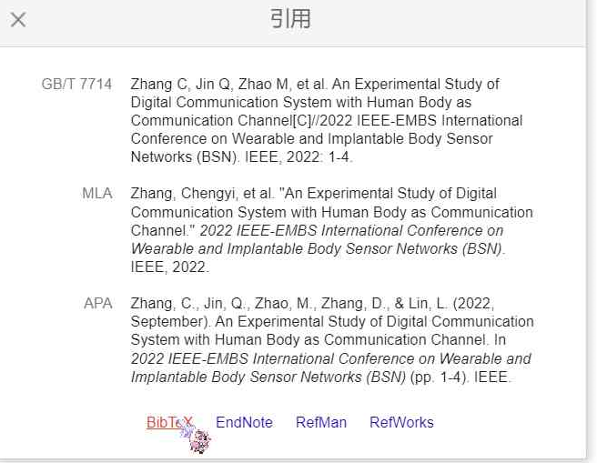
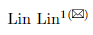
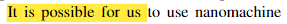

# Latex-Note
### 1.论文引用
首先需要创建一个.bib文件用以存放引用的bibtex，这里比如我们创建一个名为refer.bib的文件

在文章末尾添加
```
\bibliographystyle{IEEEtran} %ieeetrans的引用格式
\bibliography{refer} % refer就是之前建立的refer.bib文件的前缀
```
如果用的是Springer投稿模板LLCNS首先需要把splncs04.bst放入根目录下，然后使用
```
\bibliographystyle{splncs04}
```
接下来需要在bib文件里添加我们引用的文章

我们需要在google scholar上复制bibtex并添加到文件中（截图来自步骤记录器）


接下来在文中使用\cite{}就可以对需要的论文进行引用

### 2.如何添加小信封标识
如果投递paper时用到了Springer投稿模板LLCNS，我们可能需要用到小信封标识来指明留下的作者的邮箱是哪位作者的

这里要先添加宏包
```
\usepackage[misc]{ifsym}
```
然后使用
```
\textsuperscript{\Letter}
```
即可出现小信封标识

Example:
```
\author{Lin Lin\inst{1}\textsuperscript{(\Letter)} 
```
其效果如图所示



### 3.如何添加高亮显示
在文章头部添加
```
\usepackage{soul}
\usepackage{color}
```
正常文本使用\hl{}指令就可以进行添加高亮

Example:
```
\hl{It is possible for us }to use nanomachine
```
其效果如图所示


